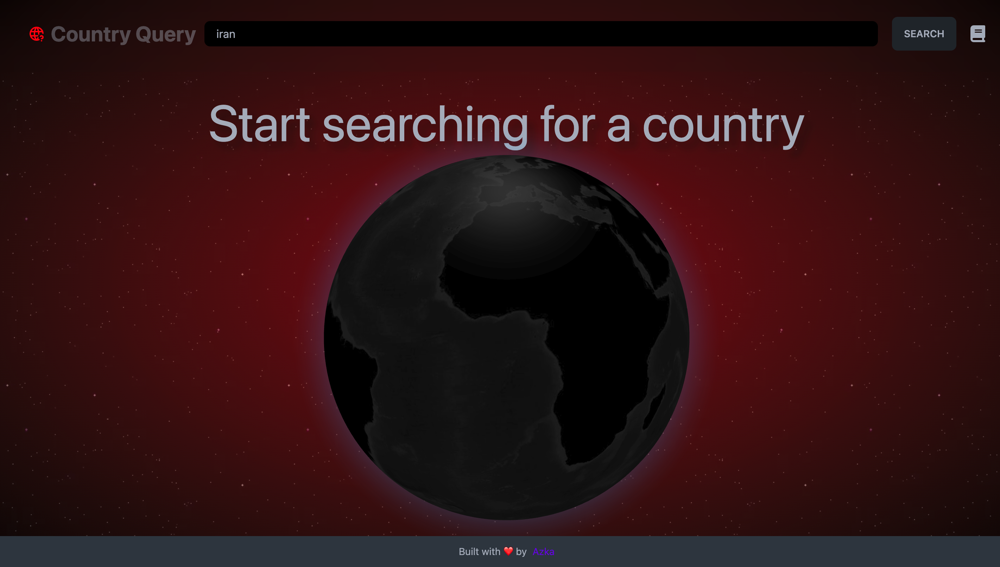
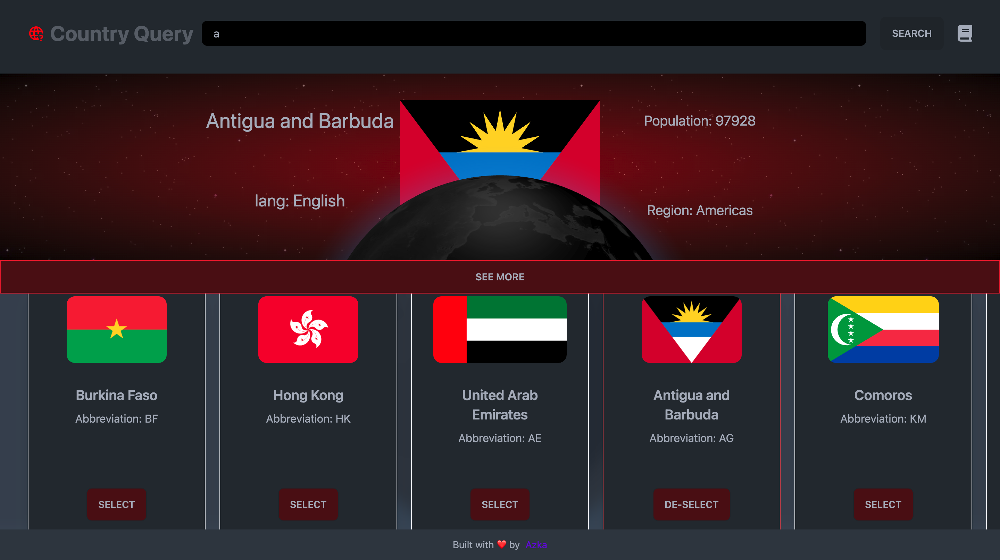
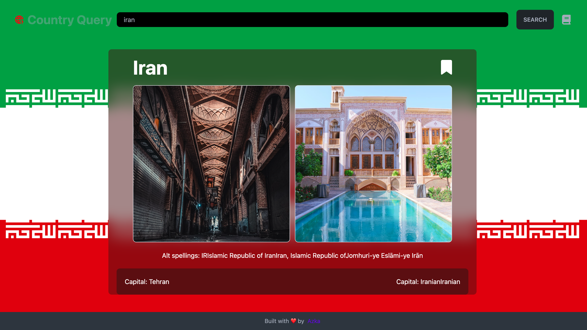

# Weather-query

demo: [https://weatherquery-react.netlify.app/](https://weatherquery-react.netlify.app/)

Hey there this is me AZKA 🙋‍♂️

and this is React Country query, which You can use to go anywhere in the world, just by clicking a button :), all you have to do is to search for a country, select the country, and then you're provided with nice pictures, and information about the country, you can also bookmark a certain country, and then get access to it via the /bookmarks route, this app is also fully responsive for any screen size.

✏️ How to use it:

Desktop:

- Just search for a country (english)
- Select a country from search results
- you're already provided with some information right above the search result, Click on the read more to see more details and some pictures of the country
- You can bookmark a country by clicking the bookmark button

Mobile:

- Just search for a country (english)
- Click on see details
- You can bookmark a country by clicking the bookmark button

🔴 Things i learned:

1- React router loaders, and fetching data with react router, also using createBrowserRouter instead of react router jsx syntax.
2- Experimenting with fetch to render approach
3- Start using redux
4- Working with unsplash api and rest country api
5- First encounter with three js

🤔 further improvements:

- bookmark functionalities should be inside their own slice
- adding a bookmark button to the country cards
- Refactoring to typescript
- using geolocation api to get the current location of the user, and then calling a reverse geocoding api to get the current country and showing the user's country in home page
